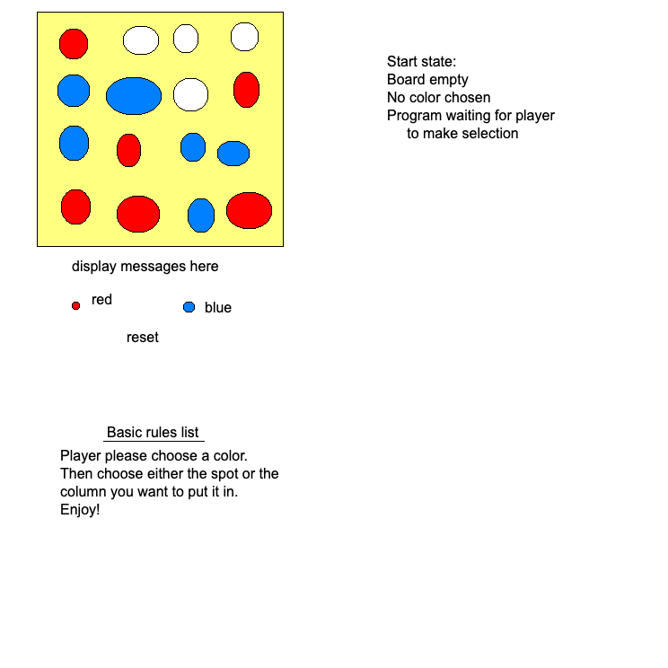

# Connect 4

Web address!!!
https://commemorable-wiggle.000webhostapp.com/

-Declare variables that need to be defined before game starts.

-Listen for player to choose color from red or blue to start game. Only one will be selectable per game.

-Set curser to player color choice. 

-Player will have to choose a column to "drop" the piece into the board by clicking on a spot directly or the column.

-Computer will put piece into the next vertical spot.

-The computer will only allow for one color per spot and it will not be able to be changed once selected. 

-Program will loop through players taking turns placing pieces in board untill board is full or 4 of the same colors are in a row. Program will identify which player's turn it is and output the text to a message under game. 

-Once a win or tie condition is met display message congradulating the winner and end game.

-Player will be able to reset game at anytime.
